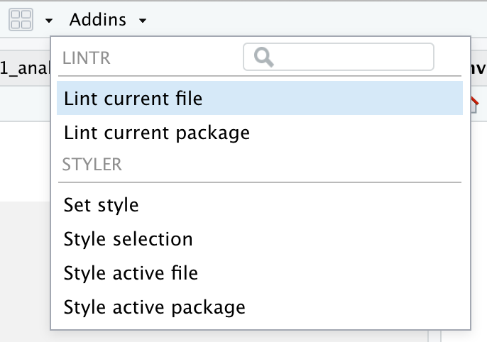

R Introduction: Part II: 
========================================================
author: INFO-201
date: 
autosize: true

Objectives
========================================================

- Use and write functions 
- Use relational and logal operators 
- Use conditionals 
- Describe what a package is
- Use install.package() and libary() too install and use packages
- Discuss what coding style is
- Use lintr and styler to format R code
- Demoonstrate basic skills for using vectors
- Demonstrate basic skills for using lists

Recall: Functions
====================================
source: ./R/example0_temp.R
(1) Defining the function

```r
# This function converts Celcius to Farenheit 
celcius_to_farenheit <- function(temp_in_C) {
  temp_in_F <- temp_in_C * (9 / 5) + 32 
  return (temp_in_F)
}
```
(2) Calling the function 

```r
print(celcius_to_farenheit(37.3))
```

```
[1] 99.14
```

```r
print(celcius_to_farenheit(0))
```

```
[1] 32
```
Recall: Functions can be Nested
====================================
Three statements 

```r
t <- celcius_to_farenheit(37.3)
t <- round(t,1)                     # Note: How does this work?
print(t)
```

```
[1] 99.1
```
Three functions in one statement

```r
print(round(celcius_to_farenheit(37.3),1))
```

```
[1] 99.1
```

Recall: Relational and Logical Operators 
========================================================
source: ./R/example4.R
Relational operators for making comparisons
- Equal (==)
- Not equal (!=)
- Greater than (>)
- Greater than or equal (>=)
- Less than (<)
- Less than or euqal (<=)
- Conditionals

```r
if (test) {
  # execute block of code
} else if (test2) {
  # execute block of code
} else {
  # execute block of code 
}
```
***
Logical pperators
- AND (&)
- OR (|)
- NOT (!) 

Practice
========================================================
Write a function that meets these specifications: 

- The function name is "compute"
- The function takes three numeric parameters, n1, n2, n3
- The function returns a number, based on these silly rules: 
  - If n1, n2, and n3 are all positive return n1 multipled by n3
  - If n1, n2, or n3 are all negative return the sum of n1, n2, and n3
  - In all other cases return 0
  
**No peaking to mext slide :)** 

Practice: One Possible Answer
========================================================
source: ./R/example4_answer.R

```r
#filename: example4_answer.R
compute <- function(n1, n2, n3) {
  # Set the default case 
  t <- 0 
  
  # Check for condition #1
  if (n1 > 0 & n2 > 0 & n3 > 0) {
    t <- n1 * n3
  }
  
  # check for condition #2
  if (n1 < 0 | n2 < 0 | n3 < 0) {
    t <- sum(n1,n2,n3)
  }
  
  return(t)
}
```

Using packages
====================================
source: ./R/example0.R
- Packages extend R and provide new functions and functionality 
- Before you can use a package you must install it into R
- To access the functions in a package, use the library() function 
- Packages only need to be installed once
- (See packages tab in RStudio)

```r
install.packages("stringr") 
library("stringr") 
```
- **Do:** explore examples to left 
- **Do:** go to the manual and read up on the functions in the stringr library

Coding Style 
====================================
- Programming communities develop coding practices
- Style - how code is presented - is one kind of practice 
- Good, consistent coding style
  - Improves readability for humans 
  - Makes it easier to find bugs
  - Shows professionalism and attention to detail 

Packages for Helping with Style
====================================
source: ./R/example1_analysis.R
Two key libraries:

```r
# Recall: Install only once
install. packages("lintr")
install. packages("styler")

library("lintr")
library("styler") 
```

Two key functions

```r
# To identify style mistakes 
lint("analysis.R")

# To automatically correct style mistakes 
style_file("analysis.R")
```
Addins: Lintr and Styler
====================================
- See the pulldown menu in the addins



Grading: We will Grade for Style
====================================
- We'll use the [tidyverse style guide](https://style.tidyverse.org) in this class
- Use lintr to check for style violations 
- Use styler to help apply correct style 

**Please Note:** 
- We will use the lintr package to check for assignment errors
- We expect no errors to appear unless otherwise specified
- You should run lintr to check for style errors

Vectors
====================================
source: ./R/example5.R
- A collection of elements 
- ONE dimension 
- All elements are of the same data type 

Two example vectors

```r
cities <- c("Seattle", "Toronto", "New York", "Portland")
temps <- c(50,86.6,95,55)
```

Vectors and Functions
====================================
Many, many funtions can be applied to vectors


```r
cities <- c("Seattle", "Toronto", "New York", "Portland")
temps <- c(50,86.6,95,55)

print(length(cities))
```

```
[1] 4
```

```r
print(toupper(cities))
```

```
[1] "SEATTLE"  "TORONTO"  "NEW YORK" "PORTLAND"
```

```r
print(mean(temps))
```

```
[1] 71.65
```

```r
print(mean(cities))  # Note error
```

```
[1] NA
```

Vectors and Elementwise Operations
====================================
- We can apply operators to each element in a vector.
- For example

```r
v1 <- c(12,3)
v2 <- v1 * 10
print(v2)
```

```
[1] 120  30
```
- We can apply a complicated expression to each item in a vector

```r
# Convert F temps into C temps
# Recall formula:  C = (F-32) * 5/9 
# How does this work (see code to the left)
temps <- c(32,50,86.6,95,55)
temps_in_C <- round((temps - 32) * 5 /9,1)
print(temps_in_C)
```

```
[1]  0.0 10.0 30.3 35.0 12.8
```
Vector Arithmatic (examples left)
====================================
- We can add, subject, and perform other operations between vectors

```r
temps_2018 <- c(32,50,86.6,100,55)
temps_2019 <- c(32,55,90,76,55)

# Compute the absolute difference between the two vectors (elements pairs)
temp_diff <- temps_2018 - temps_2019
print(temp_diff)
```

```
[1]  0.0 -5.0 -3.4 24.0  0.0
```

```r
temp_diff <- abs(temp_diff)
print (temp_diff)
```

```
[1]  0.0  5.0  3.4 24.0  0.0
```

```r
print(abs(temps_2018 - temps_2019))
```

```
[1]  0.0  5.0  3.4 24.0  0.0
```

Vector and Relational Operators (examples left)
====================================
We can apply boolean operators, resulting in vector with boolean values

```r
# Apply a relational operator to each element pair 
temp_comp <- temps_2019 > temps_2018
print(temp_comp)
```

```
[1] FALSE  TRUE  TRUE FALSE FALSE
```
Vector Recycling
====================================
- If two vectors are of unequal length, the shorter one will be recycled in order to match the longer vector. 

```r
v1 <- c(1, 2, 3)
v2 <- c(100, 200, 300, 400, 500, 600, 700, 800, 900, 1000)
v3 <- v1 + v2
print(v3)
```

```
 [1]  101  202  303  401  502  603  701  802  903 1001
```
Vector Indexing (By Position)
====================================
- Frequently we need to refer to a specific element in a vector 

```r
temps_2018 <- c(32,50,86.6,100,55)
temps_2019 <- c(32,55,90,76,55)

# The first item
print(temps_2018[1])
```

```
[1] 32
```

```r
# The last item

len <- length(temps_2018)
print(temps_2018[len])
```

```
[1] 55
```

Vector Indexing (By Vector of Indices)
====================================
- Frequently we need to refer to a sub-set of items in a vector

```r
temps_2018 <- c(32,50,86.6,100,55)
temps_2019 <- c(32,55,90,76,55)

# The first and third elements 
indices <- c(1,3)
print(temps_2018[indices])
```

```
[1] 32.0 86.6
```

```r
# The first, second, and thrid elements
print(temps_2018[c(1,2,3)])
```

```
[1] 32.0 50.0 86.6
```

```r
# The first and last elments 
print(temps_2018[c(1,length(temps_2018))])
```

```
[1] 32 55
```
Vector Indexing (Logical Indices)
====================================
- Use boolean vectors to extract items from a vector

```r
temps_2018 <- c(32,50,86.6,100,55)
temps_2019 <- c(32,55,90,76,55)
temps_diff <- abs(temps_2018 - temps_2019)

# Retreive the first and forth elements
indices <- c(TRUE, FALSE, FALSE, TRUE, FALSE)
print(temps_diff[indices])
```

```
[1]  0 24
```

Vector Indexing (Logical Indices)
====================================
- Create powerful expressions with relational operators

```r
temps_2018 <- c(32,50,86.6,100,55)
temps_2019 <- c(32,55,90,76,55)
temps_diff <- abs(temps_2018 - temps_2019)

# The relational expression (a kind of query)
big_diffs <- temps_diff > 4
print(big_diffs)
```

```
[1] FALSE  TRUE FALSE  TRUE FALSE
```

```r
print(temps_diff[big_diffs])
```

```
[1]  5 24
```

```r
print(temps_diff[temps_diff > 4])
```

```
[1]  5 24
```

Lists
====================================
source: ./R/example6.R

- A collection of items (like a vector)
- The items can be of different types (NOT like a vector)
- Useful for storing an "object" or "observation" 

```r
temp1 <- list(loc="Seattle", temp=55, validated=TRUE)
temp2 <- list(loc="Toronto", temp=35, validated=FALSE)

print(temp1)
```

```
$loc
[1] "Seattle"

$temp
[1] 55

$validated
[1] TRUE
```
Lists in Vectors
====================================
- Often lists are elements of vectors

```r
temp1 <- list(loc="Seattle", temp=55, validated=TRUE)
temp2 <- list(loc="Toronto", temp=35, validated=FALSE)

temps <- c(temp1,temp2)
print(temps)
```

```
$loc
[1] "Seattle"

$temp
[1] 55

$validated
[1] TRUE

$loc
[1] "Toronto"

$temp
[1] 35

$validated
[1] FALSE
```

Retrieving Data from a List
====================================
- Three notations 

```r
# By name and $
loc1 <- temp1$loc
print(loc1)
```

```
[1] "Seattle"
```

```r
# By name and double brackets
loc2 <- temp2[["loc"]]
print(loc2)
```

```
[1] "Toronto"
```

```r
# By index
temp <- temp1[[2]]
print(temp)
```

```
[1] 55
```
Single v. Double Brackets
====================================

```r
temp1["loc"] # returns the equivalent of list("Seattle")
```

```
$loc
[1] "Seattle"
```

```r
temp1[["loc"]] # returns the equivalent of "Seattle"
```

```
[1] "Seattle"
```
Applying Fuctions to Lists with lapply() 
====================================

```r
prices <- c(100, 200)
sqrt_prices <- sqrt(prices)
print(sqrt_prices)
```

```
[1] 10.00000 14.14214
```

```r
prices <- list(p1=100, p2=200)
print(lapply(prices, sqrt))
```

```
$p1
[1] 10

$p2
[1] 14.14214
```
Done
====================================
- That was a lot!
- Suggestions for learning to code:
  - Focus on the details
  - Break up expressions into smaller bits
  - Try to understand the bits 
  - Test your understanding by modify the code 
  - If you get stuck as for help (Coding is a social and individual activity)
  - Go slow and work on it each day.
- Reminder: Read Freeman & Ross (2019), chapters 5,6,7, and 8

