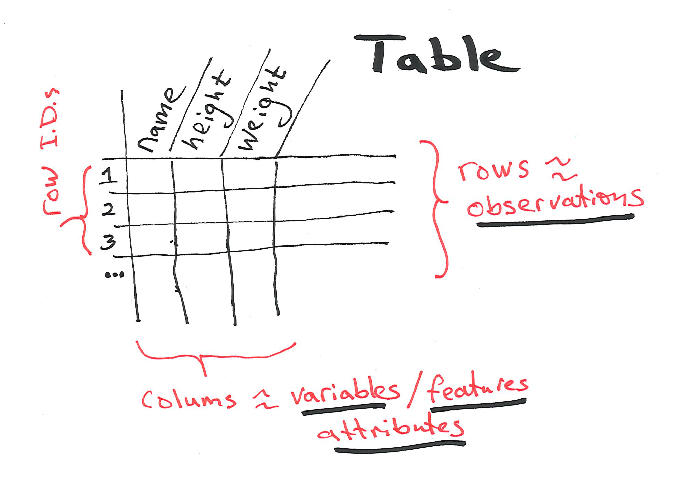
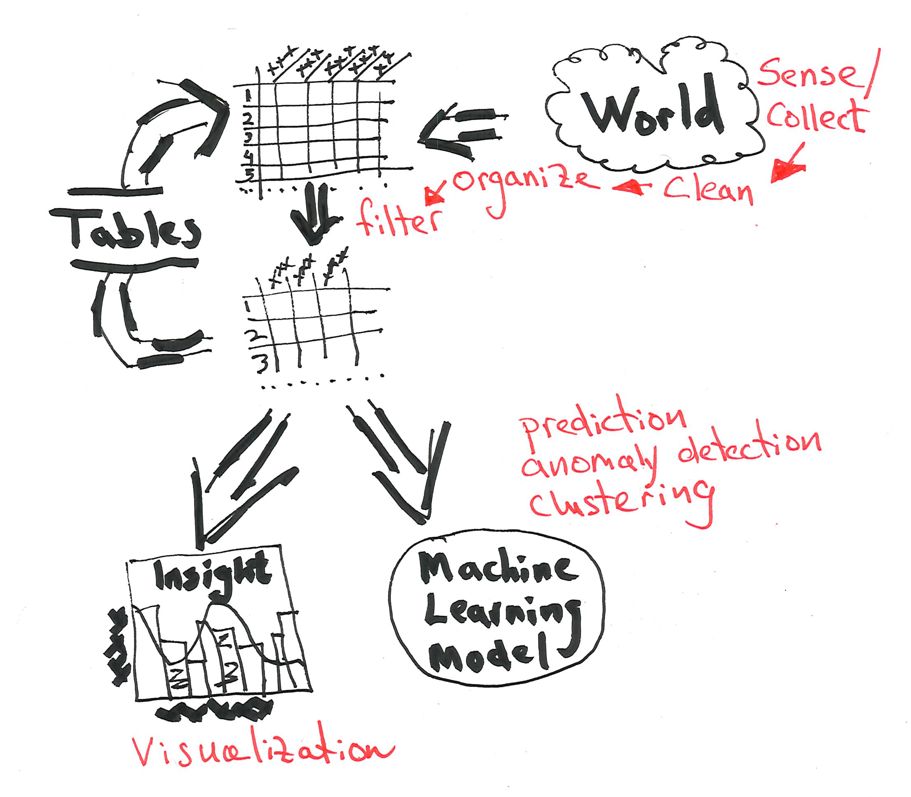
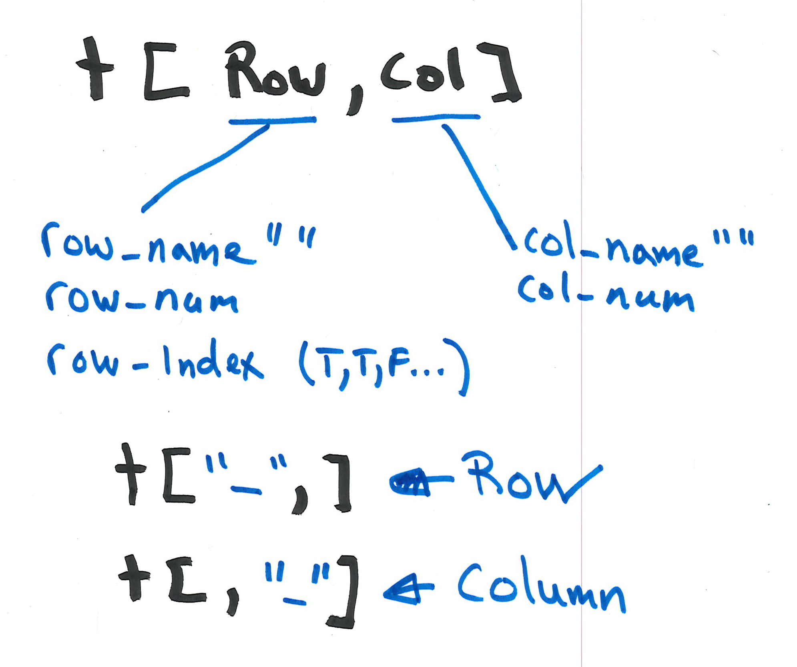
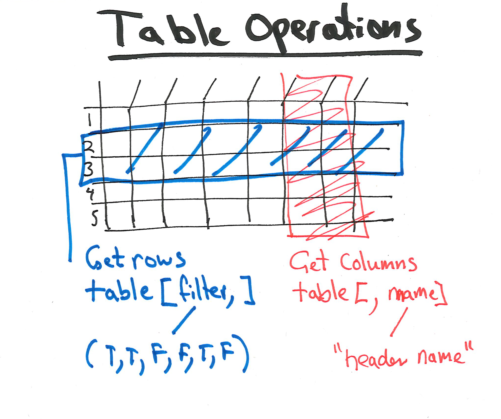

R Data Frames
========================================================
author: INFO-201
date: 
autosize: true

Objectives
========================================================
- Describe the structure and purpose of data frames
- Create a data frame
- Create a data frame from a CSV file 
- Given specific query tassk, access rows, columns, and data elements  
- Begin to work with a real data set of reasonable size
  - 3000 observations and 10 features

Tables
====================================
source: ./R/example1.R
- Tables of data are extremely common in data science
- Input into: 
  - Machine learning algorithms
  - Vizualizations  

Conceptual model
====================================


Tables in Data Science
====================================


Accessing by Rows and Columns
====================================


Operations on tables
====================================


Creating a data table
====================================
- Recall that a data frame is a **list of vectors** (with additional capabilities)
- Each vector is the same length and same data type

```r
# Create a data frame
people <- data.frame(
  name = c("Ada", "Bob", "Chris", "Diya", "Emma"),
  height = c(64, 74, 69, 69, 71),
  weight = c(135, 156, 139, 144, 152),
  stringsAsFactors = FALSE
)
```

Creating a data table
====================================
- Frequently, we create a data frame from a CSV file 
- A comma separated value (CSV) file represents a table of data
- Easily created in editors and in spreadsheets

```rn
name,height,weight
Ada,64,135
Bob,74,156
Chris,69,139
Diya,69,144
Emma,71,152
```
Creating a data table
====================================
- You can load a CSV file into a data frame with this code: 

```r
# Set working directory
#setwd("~/Documents/__INFO-201/05slides/2019/R-Slides/R-lecture-03")

# Read the file 
df <- read.csv( "./Data/people.csv",
                header=TRUE, 
                stringsAsFactors=FALSE
              )
```
Describing the structure of a data frame
====================================

```r
# The top of the data frame
head(df)
```

```
   name height weight
1   Ada     64    135
2   Bob     74    156
3 Chris     69    139
4  Diya     69    144
5  Emma     71    152
```

```r
# The dimensions of the data frame (rows by columns)
dim(df)
```

```
[1] 5 3
```
Describing the structure of a data frame
====================================
- How do you determine the column names? 
- How do you determine the row names? 

- Try the View() command to view a data frame

Accessing data frames
====================================
source: ./R/example2.R
- Bracket notation can be used to
  - Access cells
  - Access rows
  - Access colums
- Complex queries can be written quite easily

Accessing a cell with row and column names
====================================

```r
# The row named "3" and the column "height"
df["3", "height"]
```

```
[1] 69
```


```r
# The third row and the column "height"
df[3, "height"]
```

```
[1] 69
```


```r
# Pass in a vector of two column names (return a vector of size 2)
df["3", c("height", "weight")]
```

```
  height weight
3     69    139
```

Accesing the column vectors 
====================================

```r
print(df)
```

```
   name height weight
1   Ada     64    135
2   Bob     74    156
3 Chris     69    139
4  Diya     69    144
5  Emma     71    152
```

```r
# The column name
print(df[, "height"])
```

```
[1] 64 74 69 69 71
```

```r
# Computer average height
print(mean(df[,"height"]))
```

```
[1] 69.4
```

Accessing rows by vector filtering
====================================

```r
print(df)
```

```
   name height weight
1   Ada     64    135
2   Bob     74    156
3 Chris     69    139
4  Diya     69    144
5  Emma     71    152
```

```r
# Show all rows that meet condition
filter <- c(FALSE, TRUE, FALSE, FALSE, TRUE)
result <- df[filter,]
print(result)
```

```
  name height weight
2  Bob     74    156
5 Emma     71    152
```

Create filters based on a test (sometimes called a "predicate")
====================================
- Set a vector to booleans

```r
print(df)
```

```
   name height weight
1   Ada     64    135
2   Bob     74    156
3 Chris     69    139
4  Diya     69    144
5  Emma     71    152
```

```r
# Get heights as a vector
heights <- df[,"height"]
# Test each element in vector 
filter <- heights >= 70
# Generate result
result <- df[filter,]
print(result)
```

```
  name height weight
2  Bob     74    156
5 Emma     71    152
```
Complex filters
====================================
- Set a vector to booleans

```r
print(df)
```

```
   name height weight
1   Ada     64    135
2   Bob     74    156
3 Chris     69    139
4  Diya     69    144
5  Emma     71    152
```

```r
# Get heights and weights as vectors
heights <- df[,"height"]
weights <- df[,"weight"]
# Test each element in vector 
filter <- (heights >= 70) & (weights < 155)
# Generate result
result <- df[filter,]
print(result)
```

```
  name height weight
5 Emma     71    152
```
Complex filters
====================================
The predicate can be placed directly in the bracket notation

```r
print(df)
```

```
   name height weight
1   Ada     64    135
2   Bob     74    156
3 Chris     69    139
4  Diya     69    144
5  Emma     71    152
```

```r
result <- df[(df$height>=70) & (df$weight < 155),]
print(result)
```

```
  name height weight
5 Emma     71    152
```
Adding rows to data frames 
====================================

```r
# Create a data frame
people <- read.csv( "./Data/people.csv",
                header=TRUE, 
                stringsAsFactors=FALSE
              )
# Create a new data frame
new_person <- data.frame(name="Bill",height=73,weight=155)
# Put them togeterh
people <- rbind(people,new_person)
print(people)
```

```
   name height weight
1   Ada     64    135
2   Bob     74    156
3 Chris     69    139
4  Diya     69    144
5  Emma     71    152
6  Bill     73    155
```
Saving a data frame 
====================================

```r
# Create a data frame
write.csv(people,"./Data/new_people.csv",row.names=FALSE)
```
Natural Amenities Scale 
====================================
source: ./R/example3.R


***
- Each county in the U.S. is ranked for beauty
- Investigate this data and develop some questions 
- See source code and meta data on left

- We'll discuss problem sitation and data set in class
- We'll formulate some questions and try to answer them

- See: http://www.arfsys.com

Finished
====================================
- Manipuating tables is an essental task in data science 
- Tables go into data vizulatations 
- Tables go into maching learning algrithms

