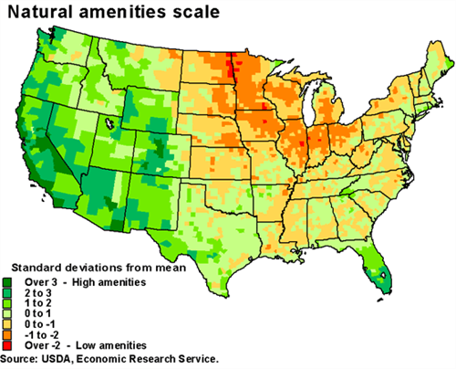

R Data Frames (continued)
========================================================
author: INFO-201
date: 
autosize: true

Objectives
========================================================
- Describe the structure and purpose of data frames
- Create a data frame
- Create a data frame from a CSV file 
- Given specific query tassk, access rows, columns, and data elements  
- Begin to work with a real data set of reasonable size
  - 3000 observations and 10 features

Recall: Creating a data fram in code
====================================
source: ./R/example2.R

```r
  people_df <- data.frame(
    name = c("Ada", "Bob", "Chris", "Diya", "Emma"),
    height = c(64, 74, 69, 69, 71),
    weight = c(135, 156, 139, 144, 152),
    stringsAsFactors = FALSE
  )
print(people_df)
```

```
   name height weight
1   Ada     64    135
2   Bob     74    156
3 Chris     69    139
4  Diya     69    144
5  Emma     71    152
```

Complex filters
====================================

```r
# Get heights and weights as vectors
heights <- people_df[,"height"]
weights <- people_df[,"weight"]
# Test each element in vector 
filter <- (heights >= 70) & (weights < 155)
# Generate result
result <- people_df[filter,]
print(result)
```

```
  name height weight
5 Emma     71    152
```
Complex filters
====================================
The predicate can be placed directly in the bracket notation

```r
result <- people_df[(people_df$height>=70) & (people_df$weight < 155),]
print(result)
```

```
  name height weight
5 Emma     71    152
```
Complex filter task
====================================

**Task:** Write a query which returns rows from ```people_df``` where:

(1) The _name_ of the person is "Ada"

(2) OR the _weight_ of the person is greater than 150.


Adding rows to data frames 
====================================

```r
# Create a data frame
people <- read.csv( "./Data/people.csv",
                header=TRUE, 
                stringsAsFactors=FALSE
              )
# Create a new data frame
new_person <- data.frame(name="Bill",height=73,weight=155)

# Put them together (rbind - "row combine")
people <- rbind(people,new_person)
```
Adding rows to data frames (continued)
====================================

```r
print(people)
```

```
   name height weight
1   Ada     64    135
2   Bob     74    156
3 Chris     69    139
4  Diya     69    144
5  Emma     71    152
6  Bill     73    155
```

Saving a data frame 
====================================

```r
# Create a data frame
write.csv(people,"./Data/new_people.csv",row.names=FALSE)
```
Natural Amenities Scale 
====================================
source: ./R/example3.R


***
- Each county in the U.S. is ranked for beauty
- Investigate this data and develop some questions 
- See source code and meta data on left

- We'll discuss problem sitation and data set in class
- We'll formulate some questions and try to answer them

- See: http://www.arfsys.com

Finished
====================================
- Manipuating tables is an essental task in data science 
- Tables go into data vizulatations 
- Tables go into maching learning algrithms

